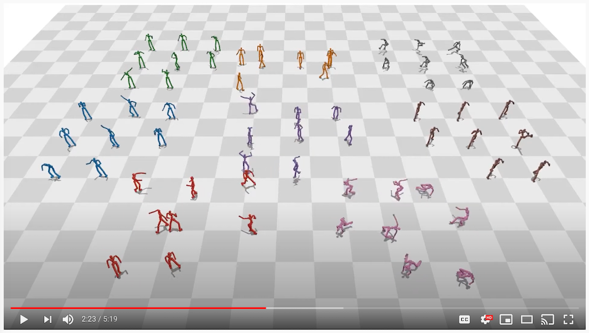

# ScaDiver

## Introduction

[](https://www.youtube.com/watch?v=QnIwwAKX5H4&t)

This repository provides executable codes for the paper *A Scalable Approach to Control Diverse Behaviors for Physically Simulated Characters*, which was published in SIGGRAPH 2020. Click [here](https://research.fb.com/publications/a-scalable-approach-to-control-diverse-behaviors-for-physically-simulated-characters/) to see the paper. The name of the project originates from the two keywords in the name of the paper, which are **SCA**lable and **DIVER**se.

Please note that we are not able to guarantee that the codes will work if it is run with settings that we did not intend when we developed for the project. We would appreciate it if users could report the problems when they find it.

## Citation

```
@article{
    ScaDiver,
    author = {Won, Jungdam and Gopinath, Deepak and Hodgins, Jessica},
    title = {A Scalable Approach to Control Diverse Behaviors for Physically Simulated Characters},
    year = {2020},
    issue_date = {July 2020},
    volume = {39},
    number = {4},
    url = {https://doi.org/10.1145/3386569.3392381},
    journal = {ACM Trans. Graph.},
    articleno = {33},
}
```

## Getting Started

### Installation

Although we only confirmed that the codes work correctly in Ubuntu (18.04) environment, probably it will work in other environments without much troubles if it is installed in a fresh Python virtual environment, which we recommend users to use to prevent from mixing different pakage versions.

#### ScaDiver

```
git clone https://github.com/fairinternal/ScaDiver
```

#### fairmotion

[fairmotion](https://github.com/fairinternal/fairmotion) provides functionalities to process motion capture data and, to compute kinematics, to visualize simulated characters and environments.

```
pip install fairmotion
```

#### others

We use [PyBullet](https://pybullet.org/wordpress/) for physics simulation and [rllib](https://docs.ray.io/en/latest/rllib.html) for reinforcement learning. 

```
pip install pybullet==2.7.3 ray[rllib]==0.8.7 pandas requests
```

### Examples

#### Test Tracking Environment

In this example, a humanoid character will be loaded into space where only the ground plane exists, and it will be simulated without any control. Please press **a** to simulate and press **r** to reset.

```
python env_humanoid_tracking.py
```

#### Test Imitation Environment

In this example, a humanoid character will be loaded into space where only the ground plane exists, and its initial states will be set by some motion capture data specified in the specification file (test_env_humanoid_imiation.yaml). Please note that the character will fall immediately because the current controller is the one not trained at all.

```
python rllib_driver.py --mode load --spec data/spec/test_env_humanoid_imitation.yaml --project_dir ./
```

#### Learning Experts and Mixture of Experts Controllers

To learn expert controllers for a set of heterogeneous motion capture data, we first need to cluster the data according to some motion features. For this, please refer to an example in [fairmotion](https://github.com/fairinternal/fairmotion) about *motion clustering*. After clustering the data, each expert controller can be learned by using only data involved in each cluster.

```
python rllib_driver.py --mode train --spec data/spec/spec_env_humanoid_imitation_expert0.yaml --project_dir ./ --local_dir ./data/learning/experts/
python rllib_driver.py --mode train --spec data/spec/spec_env_humanoid_imitation_expert1.yaml --project_dir ./ --local_dir ./data/learning/experts/
...
python rllib_driver.py --mode train --spec data/spec/spec_env_humanoid_imitation_expert7.yaml --project_dir ./ --local_dir ./data/learning/experts/
```

After expert controllers are learned, they can be combined as a single *mixture-of-experts* controller. In our framework, this can be simply achieved by setting the type of policy model as *moe* as below. 

```
python rllib_driver.py --mode train --spec data/spec/spec_env_humanoid_imitation_moe.yaml --project_dir ./ --local_dir ./data/learning/moe/
```

When the training process is performed, it will automatically create logs by using Tensorboard in the *local_dir/project_name*. The status can be checked by the script below.

```
tensorboard --logdir="directory_where_tensorboard_log_exists"
```

According to the iteration number specified in the specification file, it will automatically save intermediate results in the *local_dir/project_name/checkpoint/*. Testing the controllers can be done as below.

```
python rllib_driver.py --mode load --spec "some_specification_file" --project_dir ./ --checkpoint "some_saved_checkpoint_file"
```

### Specification File

Every experiment requires a unique specification file (yaml) that includes all the settings about individual experiments. Most of the elements are easy to understand by its name and it is based on **rllib**'s configuration file. We will explain only our environment-specific settings below, please refer to the documentation of **rllib** for other settings.

#### Reward

Because the optimality of learned policy is defined by the definition of reward function in reinforcement learning, changing the function is the only way for users to design the policy so that it has desirable properties/behaviors. As a result, testing many reward functions by combining various terms with different combinations is a critical process in many researches including ours. We implemented a flexible way to test various functions by simply modifying a specification file.

Our reward function is defined in a tree-like manner, where each node could be a *operation* among child nodes or a *leaf* that defines a term. For example, the function below is a multiplicative reward function composed of the five terms (pose_pos, pose_vel, ee, root, and com), where each term has its own kernel function. Currently, we only support *gaussian* and *none* kernel functions. By simply changing the operation of the root node from *mul* into *add*, we can test an additive reward function. If we want to change weight values for the terms, we can simply change *weight* in the leaf nodes.

We can also define multiple reward functions in the same specification files (please note that their names should be unique), then choose one of them according to experiments by setting the name which we want to test in *fn_map*.

```
reward: 
    fn_def:
        default:
            name: total
            op: mul
            child_nodes:
              - name: pose_pos
                op: leaf
                weight: 1.0
                kernel: 
                    type: gaussian
                    scale: 40.0
              - name: pose_vel
                op: leaf
                weight: 1.0
                kernel: 
                    type: gaussian
                    scale: 1.0
              - name: ee
                op: leaf
                weight: 1.0
                kernel: 
                    type: gaussian
                    scale: 5.0
              - name: root
                op: leaf
                weight: 1.0
                kernel: 
                    type: gaussian
                    scale: 2.5
              - name: com
                op: leaf
                weight: 1.0
                kernel: 
                    type: gaussian
                    scale: 2.5
    fn_map:
        - default
```

#### Early Termination

We can use various early termination strategies. For example, we can terminate the current episode when the character falls down, or the average reward for 1s is below a specific threshold as used in our paper. 

```
early_term:
    choices: # 'sim_div', 'sim_window', task_end', 'falldown', 'low_reward'
        - task_end
        - low_reward
    low_reward_thres: 0.1
    eoe_margin: 0.5
```

#### Characters

The character fields include character-specific information. 

```
character:
    name:
        - humanoid
    char_info_module:
        - amass_char_info.py
    sim_char_file:
        - data/character/amass.urdf
    ref_motion_scale:
        - 1.0
    base_motion_file:
        - data/motion/amass_hierarchy.bvh
    ref_motion_db:
        -
            data:
                file:
                    - data/motion/test.bvh
    actuation: 
        - spd
    self_collision: 
        - true
    environment_file: []
```

#### Others

If true, the environment will be fully created when *reset* is called. This is useful when the creation of the environment is expensive. Please search with the keyword *Expensive Environments* [here](https://docs.ray.io/en/latest/rllib-env.html#:~:text=Expensive%20Environments,-Some%20environments%20may&text=RLlib%20will%20create%20num_workers%20%2B%201,until%20reset()%20is%20called.) for more details.

```
lazy_creation: false
```

When the codes run, we assume that the current working directory (cwd) is the root directory where the project is originally saved. However, there exist some cases when the cwd could be changed by other external libraries such as *rllib*, so specifying *project_dir* is necessary to keep the root directory of the project.

```
project_dir: /home/jungdam/Research/opensource/ScaDiver/
```

Time steps for physics simulation

```
fps_sim: 480
```

Time steps for control policies

```
fps_con: 30
```

If true, small noise will be added to th the initial state of the character
```
add_noise: false
```

If true, some additional information will be printed. Please use this only for testing environments.

```
verbose: false
```

This defines which information will be added to the state of the character. 'body' will include the physical state of the simulated character such as joint angles and joint angular velocities, 'task' will include the difference between the simulated character and the currently playing reference motion.

```
state:
    choices: ['body', 'task'] # 'body', 'imitation', 'interaction', 'task'
```

This includes information on the action space for our environment. Basically, the action space is a target posture that includes a set of target joint angles except for the root joint. 'range_min/range_max' defines the range of joint angles in radian for which we will use, and 'range_min_pol/range_max_pol' defines the range of output values of the policy (controller). In other words, there exists a linear mapping from (range_min_pol, range_max_pol) to (range_min, range_max). For example in the setting below, the full range of motion of our simulated character is between -3.0 radian and 3.0 radians from its base posture (t-pose), and if the policy outputs 3.0 for a specific joint, the environment will interpret the value as 3.0 radians. This feature is especially useful when we want to restrict the range of motion of the simulated character (range_min/range_max will be useful), or the policy has special output layers such as *tanh* (range_min_pol/range_max_pol will be useful).

```
action:
    type: "absolute" # 'absolute', 'relative'
    range_min: -3.0
    range_max: 3.0
    range_min_pol: -3.0
    range_max_pol: 3.0
```

## Using Clusters

Because our framework is based on *rllib*, it can run not only on a single machine with multiple cores but also on clusters such as AWS, Azure, or customized one managed by Slurm. Please refer to [this](https://docs.ray.io/en/latest/cluster/index.html) for more detail.

## Pretrained Model

To be updated.

## License

ScaDiver is released under the [BSD-3-Clause License](https://github.com/fairinternal/ScaDiver/blob/master/LICENSE).
